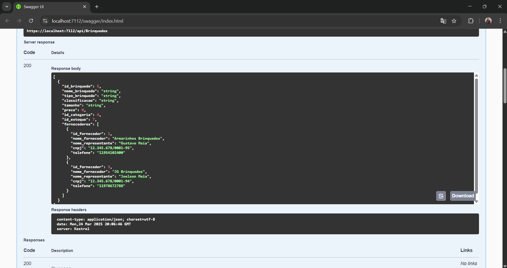
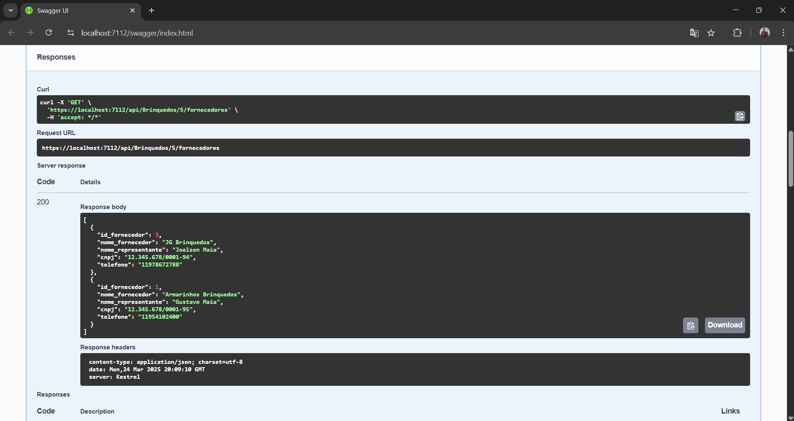
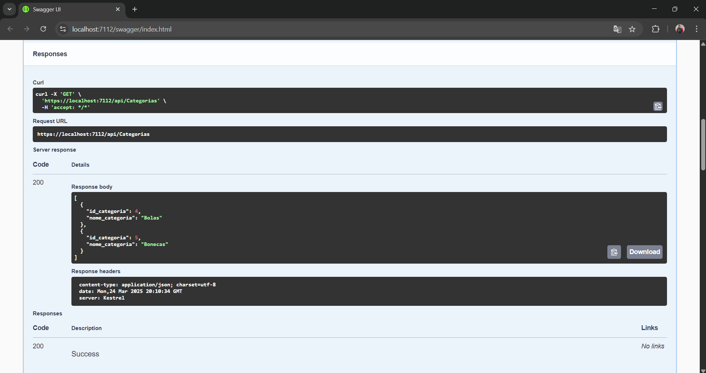
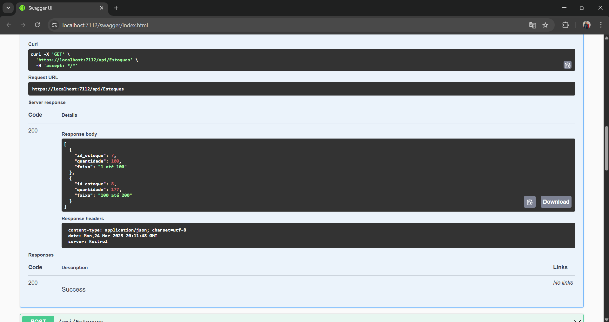
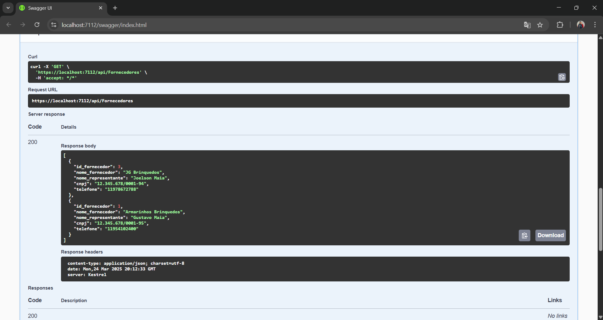

# BrinquedosAPI - Documentação Completa

## 📖 Índice
- [Tecnologias Utilizadas](#-tecnologias-utilizadas)
- [Estrutura do Projeto](#-estrutura-do-projeto)
- [Como Executar](#-como-executar-o-projeto)
- [Endpoints da API](#-endpoints-da-api)
  - [Brinquedos](#1-brinquedos)
  - [Categorias](#2-categorias)
  - [Estoques](#3-estoques)
  - [Fornecedores](#4-fornecedores)
- [Relações Especiais](#-relações-especiais)
- [Exemplos de Uso](#-exemplos-de-uso)

---

## 🚀 Tecnologias Utilizadas
- **.NET 6**
- **Entity Framework Core**
- **Oracle Database**
- **Swagger/OpenAPI**
- **DTO Pattern**

---

## 📋 Estrutura do Projeto
```
BrinquedosAPI/
├── Controllers/
│   ├── BrinquedosController.cs
│   ├── CategoriasController.cs
│   ├── EstoquesController.cs
│   └── FornecedoresController.cs
├── Data/
│   ├── AppDbContext.cs
│   ├── Brinquedo.cs
│   ├── Categoria.cs
│   ├── Estoque.cs
│   ├── Fornecedor.cs
│   └── BrinquedoFornecedor.cs
├── DTOs/
│   ├── (Todos os DTOs existentes)
│   ├── FornecedorDTO.cs
│   └── FornecedorResponseDTO.cs
└── Migrations/
```

---

## 🛠️ Como Executar o Projeto
```bash
# Clone o repositório
git clone https://github.com/seu-usuario/BrinquedosAPI.git
cd BrinquedosAPI

# Configure a conexão no appsettings.json
# Execute as migrações
dotnet ef database update

# Inicie a aplicação
dotnet run
```
Acesse: `https://localhost:5001/swagger`

---

## 📚 Endpoints da API

### 1. Brinquedos
| Método | Endpoint | Descrição |
|--------|----------|-----------|
| GET | `/api/brinquedos` | Lista todos os brinquedos |
| GET | `/api/brinquedos/{id}` | Obtém um brinquedo por ID |
| POST | `/api/brinquedos` | Cria novo brinquedo |
| PUT | `/api/brinquedos/{id}` | Atualiza brinquedo |
| DELETE | `/api/brinquedos/{id}` | Remove brinquedo |

**Exemplo de Brinquedo:**
```json
{
  "id_brinquedo": 1,
  "nome_brinquedo": "Boneca Barbie",
  "tipo_brinquedo": "Boneca",
  "classificacao": "4+",
  "tamanho": "30cm",
  "preco": 99.90,
  "fornecedores": [
    {
      "id_fornecedor": 1,
      "nome_fornecedor": "Distribuidora de Brinquedos LTDA"
    }
  ]
}
```

### 2. Categorias
| Método | Endpoint | Descrição |
|--------|----------|-----------|
| GET | `/api/categorias` | Lista categorias |
| GET | `/api/categorias/{id}` | Obtém categoria por ID |
| POST | `/api/categorias` | Cria nova categoria |
| PUT | `/api/categorias/{id}` | Atualiza categoria |
| DELETE | `/api/categorias/{id}` | Remove categoria |

**Exemplo:**
```json
{
  "id_categoria": 1,
  "nome_categoria": "Bonecas"
}
```

### 3. Estoques
| Método | Endpoint | Descrição |
|--------|----------|-----------|
| GET | `/api/estoques` | Lista estoques |
| GET | `/api/estoques/{id}` | Obtém estoque por ID |
| POST | `/api/estoques` | Cria novo estoque |
| PUT | `/api/estoques/{id}` | Atualiza estoque |
| DELETE | `/api/estoques/{id}` | Remove estoque |

**Exemplo:**
```json
{
  "id_estoque": 1,
  "quantidade": 150,
  "faixa": "100-200"
}
```

### 4. Fornecedores
| Método | Endpoint | Descrição |
|--------|----------|-----------|
| GET | `/api/fornecedores` | Lista fornecedores |
| GET | `/api/fornecedores/{id}` | Obtém fornecedor por ID |
| POST | `/api/fornecedores` | Cria novo fornecedor |
| PUT | `/api/fornecedores/{id}` | Atualiza fornecedor |
| DELETE | `/api/fornecedores/{id}` | Remove fornecedor |

**Exemplo Completo:**
```json
{
  "id_fornecedor": 1,
  "nome_fornecedor": "Distribuidora de Brinquedos LTDA",
  "nome_representante": "João Silva",
  "cnpj": "12.345.678/0001-99",
  "telefone": "(11) 99999-9999",
  "brinquedos_fornecidos": [
    {
      "id_brinquedo": 1,
      "nome_brinquedo": "Boneca Barbie"
    }
  ]
}
```

---

## 🔗 Relações Especiais

### Associar Fornecedor a Brinquedo
```http
POST /api/brinquedos/{brinquedoId}/fornecedores/{fornecedorId}
```
**Resposta de Sucesso:**
```json
{
  "message": "Fornecedor associado com sucesso"
}
```

### Listar Fornecedores de um Brinquedo
```http
GET /api/brinquedos/{id}/fornecedores
```
**Exemplo de Resposta:**
```json
[
  {
    "id_fornecedor": 1,
    "nome_fornecedor": "Distribuidora de Brinquedos LTDA",
    "cnpj": "12.345.678/0001-99"
  }
]
```

### Remover Associação
```http
DELETE /api/brinquedos/{brinquedoId}/fornecedores/{fornecedorId}
```

---

## 📝 Exemplos de Uso Completos

### 1. Cadastro Completo de Brinquedo com Fornecedor
```http
POST /api/brinquedos
```
**Request:**
```json
{
  "nome_brinquedo": "Carrinho de Controle Remoto",
  "tipo_brinquedo": "Eletrônico",
  "classificacao": "8+",
  "tamanho": "Médio",
  "preco": 199.90,
  "id_categoria": 3,
  "id_estoque": 2
}
```

**Associar Fornecedor:**
```http
POST /api/brinquedos/5/fornecedores/2
```

### 2. Consulta Completa de Brinquedo
```http
GET /api/brinquedos/5
```
**Response:**
```json
{
  "id_brinquedo": 5,
  "nome_brinquedo": "Carrinho de Controle Remoto",
  "tipo_brinquedo": "Eletrônico",
  "classificacao": "8+",
  "tamanho": "Médio",
  "preco": 199.90,
  "categoria": {
    "id_categoria": 3,
    "nome_categoria": "Eletrônicos"
  },
  "estoque": {
    "id_estoque": 2,
    "quantidade": 75
  },
  "fornecedores": [
    {
      "id_fornecedor": 2,
      "nome_fornecedor": "Importadora de Brinquedos Eletrônicos",
      "cnpj": "98.765.432/0001-11"
    }
  ]
}
```

### 3. Cadastro de Fornecedor com Validação de CNPJ
```http
POST /api/fornecedores
```
**Request:**
```json
{
  "nome_fornecedor": "Nova Distribuidora",
  "nome_representante": "Maria Oliveira",
  "cnpj": "11.223.334/0001-55",
  "telefone": "(21) 98888-7777"
}
```

**Em caso de CNPJ duplicado:**
```json
{
  "message": "Já existe um fornecedor cadastrado com este CNPJ",
  "fornecedorExistente": {
    "id_fornecedor": 3,
    "nome_fornecedor": "Distribuidora Antiga",
    "cnpj": "11.223.334/0001-55"
  }
}
```

## GET/api/Brinquedos


## GET/api/Brinquedos/{id}/fornecedores


## GET/api/Categorias


## GET/api/Estoques


## GET/api/Fornecedores



